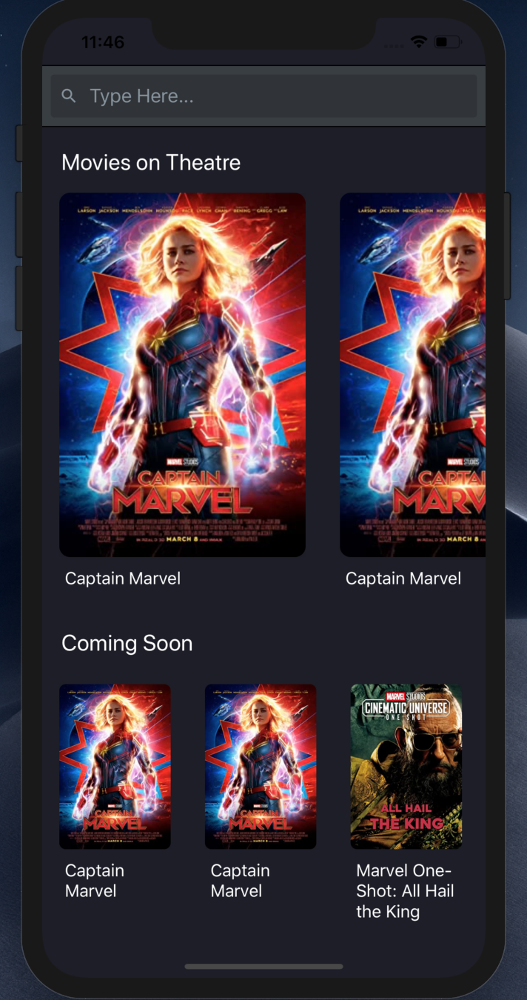
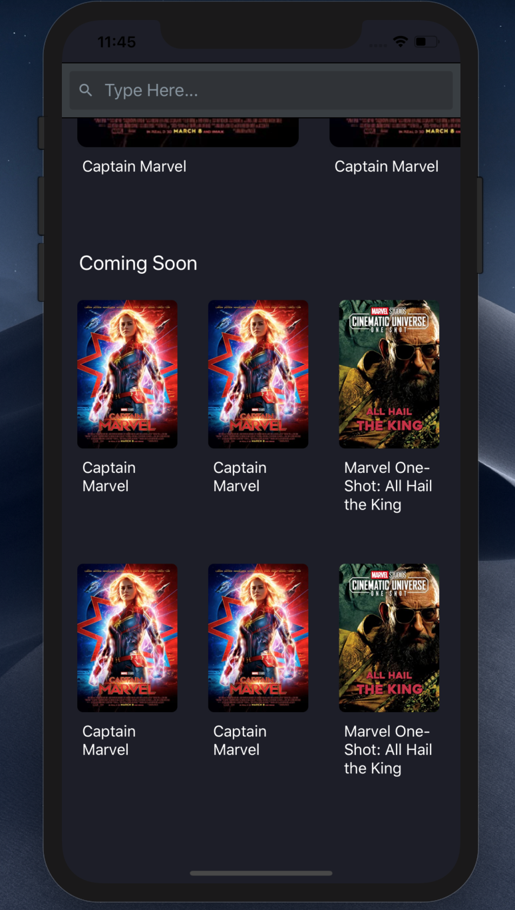
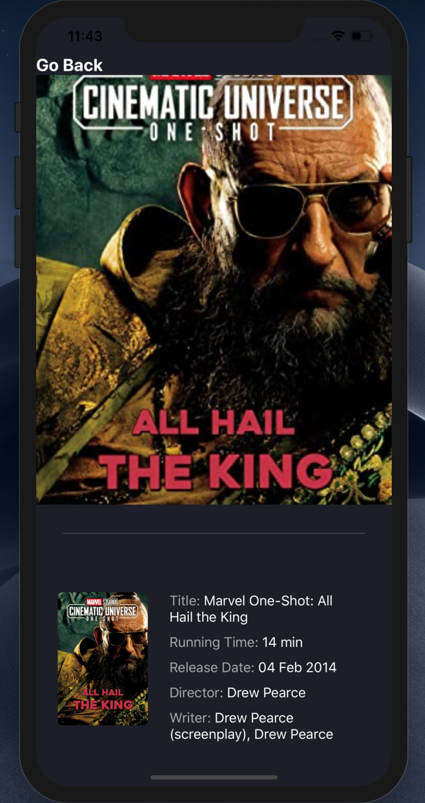

# About Movie App

  The movie app is build using react native. App will fetch the list of movies from the given 
  Api and show them on horizontal lists. On press the particular movie and it will go the detail page 
  of that movie and display relevant details about that movie. On go back press it will go back to dashboard.
  The app uses typescript as programming language, hooks for it's components and screens, redux for state management,
  redux saga for async actions, react-navigation for moving between screens, styled-components for styling 
  and Jest for unit tests.

# List of the tehcnologies used to develop the Movie App.

  1. React Native
  2. TypeScript 
  3. Hooks
  4. reactnavigation
  4. Redux and redux-saga
  5. Jest
  6. styled-components

# How to run the Movie App ?

  1. Clone the project with the " git clone https://github.com/malikbhzr/Movie-App-Malik.git "
  2. Enter in to Movie-App-Malik by typeing " cd Movie-App-Malik "
  3. Do " npm install "
  4. Do pod install " cd ios; pod install; cd .. "
  5. Run the command " npm run ios or android " to run the app
  

